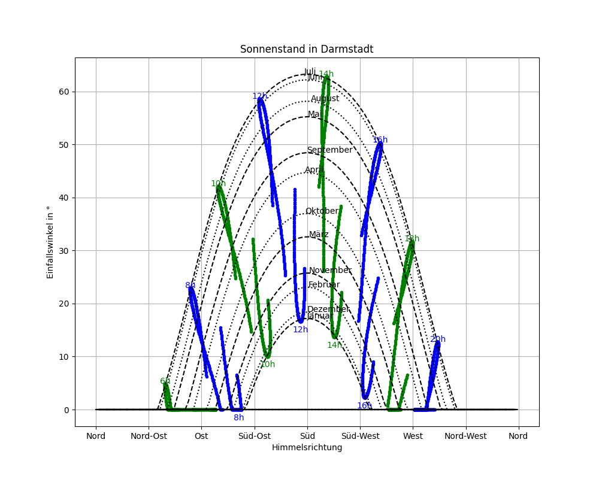

# sun-path-and-analemmas
simple python script to calculate and plot the sun path (azimuth and elevation angle) over the year for specific location on earth. 

The analemmas of the sun are calculated considering the time-shift in germany twice per year. Due to the 1h timeshift the sunpath jumps to another path for the same time of the day.

Plot labels are in german.

